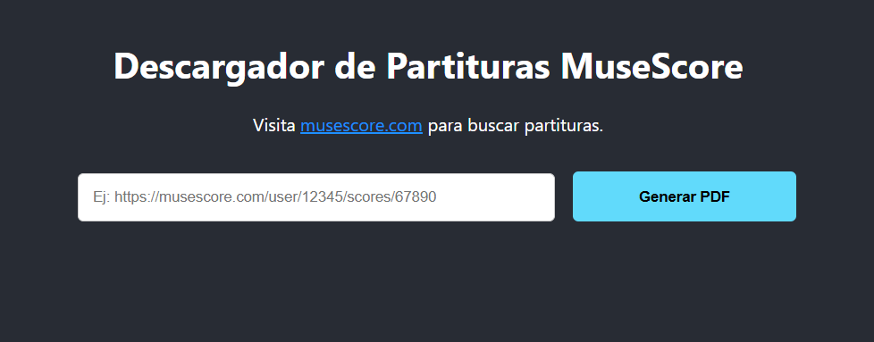
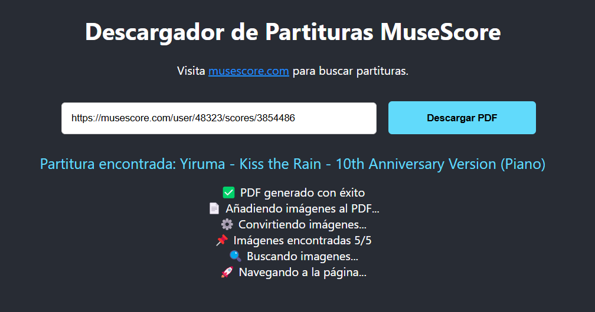

# 🎼 MuseScore to PDF Converter 🎵

Un conversor web que permite descargar partituras de MuseScore.com como PDF de alta calidad, implementando web scraping y procesamiento avanzado de imágenes.

## Visualización de la Web

### Ingreso de URL


### Descarga del PDF



## 🌟 Características Principales

- **Conversión Automática:** Transforma cualquier partitura de MuseScore.com en PDF
- **Alta Calidad:** Imágenes en alta resolución
- **Tiempo Real:** Seguimiento del proceso con actualizaciones en vivo
- **Manejo de Errores:** Reintentos automáticos y mensajes descriptivos
- **Interfaz Simple:** Fácil de usar con validación de URL integrada

## 🛠 Tecnologías Utilizadas

**Frontend:**
- React.js
- Axios
- Server-Sent Events (SSE)

**Backend:**
- Express.js
- Puppeteer (Web Scraping)
- Sharp (Procesamiento de imágenes)
- PDF-Lib (Generación de PDFs)

## 📦 Instalación

### Requisitos Previos
- Node.js v16+
- npm v8+
- Chromium (para Puppeteer)

```bash
# Clonar repositorio
git clone https://github.com/tu-usuario/musescore-to-pdf.git
cd musescore-to-pdf

# Instalar dependencias 
npm install

#Inicia el proyecto:
npm start
```

## 🖥 Cómo Usar
1. Ingresar URL:

    - Ejemplo: https://musescore.com/user/12345/scores/67890

    - Validación automática de formato

2. Proceso de Conversión:

    - Navegación a la página

    - Detección de imágenes (scroll automático)

    - Conversión a PNG (alta resolución)

    - Generación de PDF optimizado

3. Descarga:

    - PDF listo para descargar

    - Auto-borrado de archivos temporales